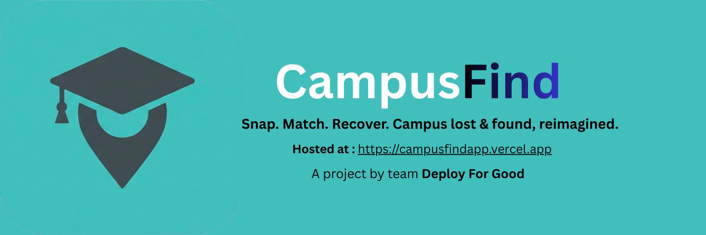
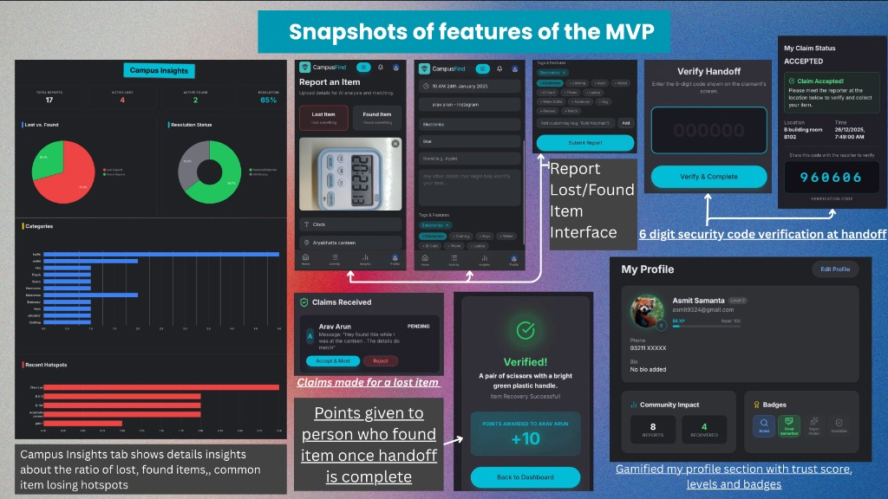

# 🎓 CampusFind



---

## The Problem :

On bustling college campuses, losing personal belongings like IDs, wallets, headphones is a daily chaos. Existing solutions are:

- **Unorganized**: Scattered across spammy WhatsApp groups and physical notice boards.
- **Unverified**: No way to know if a claim is legitimate.
- **Awkward**: Coordinating meetups with strangers can be uncomfortable.

## The Solution: CampusFind

**CampusFind** centralizes lost & found management into a secure, AI-driven platform. We replace chaos with a streamlined workflow: **Snap → Match → Verify → Recover**.

### Key Features :

#### 1. AI Vision Agents (OpenAI GPT-4o)

- **Snap & Go**: Upload a photo of a found item. Our vision agent instantly analyzes it to auto-tag **Brand**, **Color**, **Category**, and **Distinctive Features**.
- **Proactive Matching**: The system doesn't just list items; it actively compares "Lost" reports against "Found" inventory using visual similarity algorithms.

#### 2. "Magic Wand" Communication (Gemini 2.0 Flash)

- **Auto-Draft Messages**: Social anxiety? Writers block? Click "Auto-Write" and let **Google Gemini** draft a polite, context-aware message to the owner/finder in milliseconds.
- **Smart Context**: The AI understands if you are _claiming_ or _found_ an item and adjusts the tone accordingly.

#### 3. Secure Verification Chain

- **Closing the Loop**: Unlike social media posts, we track the _handover_.
- **OTP Verification**: The system generates a unique **6-digit code**. The item is only marked "Returned" when the finder scans the claimant's code at the meetup.

#### 4. Client-Side Poster Gen

- **Instant Posters**: Need a physical flyer? Generate a beautifully designed, print-ready "LOST" poster with a custom QR code directly in your browser.

#### 5. Enterprise-Grade Scale

- **Cloudinary Integration**: Images are compressed and served via CDNs for lightning-fast loading.
- **Neon Postgres**: Serverless database architecture ensures we scale from 100 to 100,000 students effortlessly.

---

## Technology Used :

| Layer         | Technologies                                                          |
| :------------ | :-------------------------------------------------------------------- |
| **Frontend**  | React, Vite, Tailwind CSS, Lucide Icons, Framer Motion                |
| **Backend**   | Python Flask, SQLAlchemy, PyJWT                                       |
| **Database**  | **Neon** (Serverless PostgreSQL)                                      |
| **AI Engine** | **Google Gemini 2.0 Flash** (Text/Logic) + **OpenAI GPT-4o** (Vision) |
| **Storage**   | **Cloudinary** (Image compression & Hosting)                          |
| **Cloud**     | Firebase (Auth & Push Notifications), Vercel (Deployment)             |

---

## SnapShots of the MVP :




---

## Website demo video :

https://www.youtube.com/watch?v=rP8kG_iP4Lg

---

## Run it on your Localhost :

### Prerequisites

- Node.js (v18+)
- Python (v3.9+)

### 1. Clone & Install

```bash
git clone https://github.com/your-username/campusfind.git
cd campusfind
```

### 2. Backend Setup

```bash
cd server
python3 -m venv venv
source venv/bin/activate
pip install -r requirements.txt
python3 app.py
```

### 3. Frontend Setup

```bash
cd ../client
npm install
npm run dev
```

---

Built with ❤️ by team **Deploy for Good** for **TechSprint Hackathon 2025 by GDG KJSCE**.
