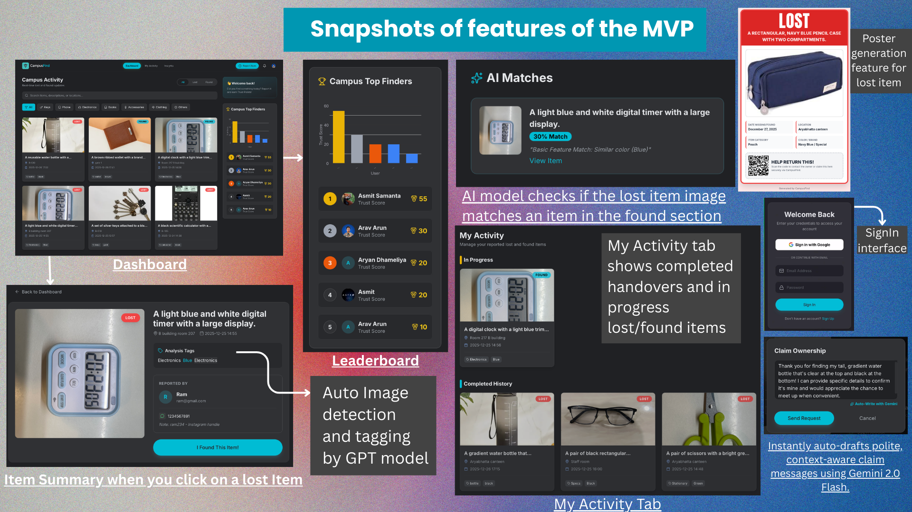
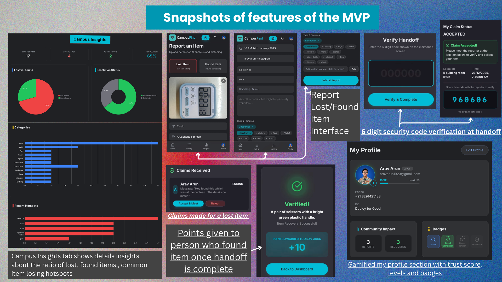

# 🎓 CampusFind


CampusFind is a smart lost-and-found platform for college campuses. It helps students report lost or found items, upload photos, discover possible matches, submit claims, and verify safe returns.

---

## The Problem

On a busy campus, losing IDs, wallets, keys, bottles, earbuds, and books is common. The usual recovery methods are messy:

- **Unorganized**: Scattered WhatsApp messages, notice boards, and word of mouth.
- **Unverified**: Anyone can claim an item without proving ownership.
- **Awkward**: Coordinating handoffs with strangers can be uncomfortable.

## The Solution

CampusFind brings the whole lost-and-found flow into one place:

**Snap → Match → Claim → Verify → Recover**

Students can upload an item photo, let AI help with tags, browse campus reports, and complete the return with a verification flow.

---

## Key Features

### 1. AI Vision Tags

- Upload a photo and get helpful tags like category, color, brand, and distinctive features.
- Makes reports easier to search and match.

### 2. Lost and Found Matching

- Lost reports and found reports are compared using item details.
- Possible matches appear directly inside the item page.

### 3. Secure Claim Flow

- Students can submit a claim request for an item.
- The reporter can accept or reject claims.
- Return verification helps close the loop after the handoff.

### 4. Trust and Activity

- Users earn trust score for helpful activity.
- The app includes profiles, recent activity, stats, and a campus leaderboard.

### 5. Cloud Image Storage

- Images are compressed and hosted with Cloudinary.
- Older Cloudinary images are handled so old reports still render correctly.

---

## Tech Stack

| Layer | Tech |
| :-- | :-- |
| **Frontend** | React, Vite, Tailwind CSS, Lucide Icons |
| **Backend** | Node.js, Express |
| **Database** | Neon Postgres, Sequelize |
| **Auth** | JWT, Google login, Firebase |
| **AI** | OpenAI vision analysis |
| **Images** | Cloudinary |
| **Deployment** | Vercel |

---

## Snapshots





---

## Demo Video

https://www.youtube.com/watch?v=rP8kG_iP4Lg

---

## Run Locally

### Backend

```bash
cd backend
npm install
cp .env.example .env
npm run dev
```

### Frontend

```bash
cd frontend
npm install
npm run dev
```

The frontend runs with Vite and proxies API requests to the backend on `http://127.0.0.1:5001`.

---

Built with ❤️ by team **Deploy for Good**.
